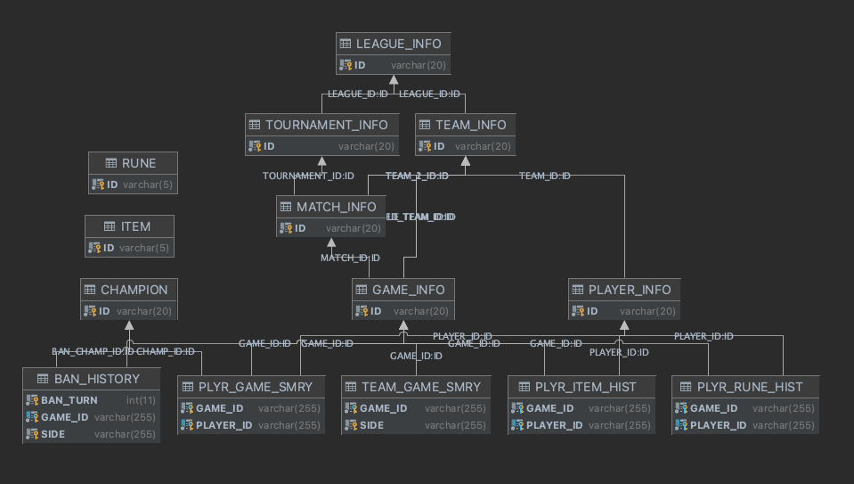

# Lol-Esports

[](https://hits.seeyoufarm.com)

Lol-Esports is a server application which provides League of Legends pro league data. 

This application crawls data by using Riot's unofficial API and Gamepedia WebPage and remodel data as relational data model for RDBMS.  

## Tech Stacks

- Java 10+
- Springboot & Gradle
- Jsoup
- JPA

## Feature

- Providing Game Component Data 
    - Champion, Item, Rune

- Providing League-Match Data
    - League, Tournament, Match, Game
    - eg. `league - LCK`, `tournament - 2021 split summer`, `match - T1 vs DK`, `game - game 1,2`  

- Providing Participant Data
    - Player, Team
    
- Providing Game Detail Data
    - Game Stat by Player and Team, Ban Log, Pick Log, Rune & Item Build Log 


## Data Model Architecture



## Configuration
 
Set up several configurations before using Lol-Esports application.

### application.yml

``` yaml
leagueoflegends:
  ddragon:
    ...
    patch-version: # Set patch version. eg. 11.13.1
    language: # Set language code. eg. en_US
    ...
  acs:
    ...
    cookie: id_token= # Set extracted id_token from leagueoflegends.com 
    ...
gamepedia:
  ...
  tournament: # Gamepedia Tournament Season. eg. 2021_Season/Summer_Season 
  ..
```

## Unofficial Riot Esports API

- Refer to [Unofficial Riot Esports API Guide](doc/unofficial-riot-api-guide.md)
